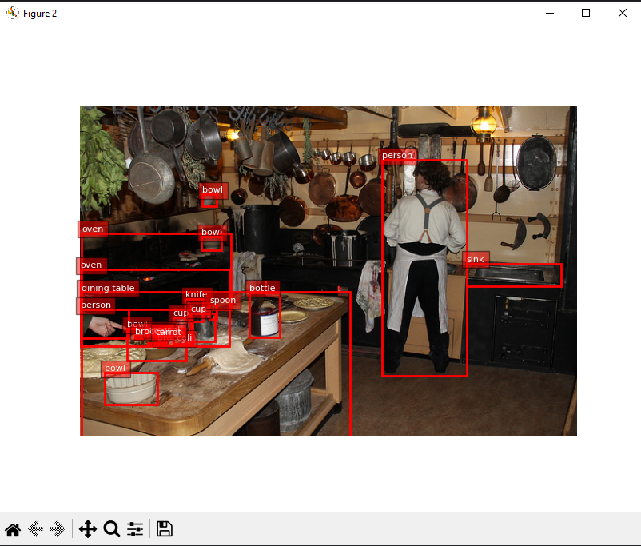

# Lab 1: COCO Dataset (Just warm up)

The COCO (Common Objects in Context) dataset is a widely used benchmark dataset in the field of computer vision. It provides a large-scale labeled dataset for various tasks such as object detection, segmentation, and captioning. The dataset is commonly used to evaluate and train models for these tasks.

During this course we will do 3 main part including data exploration/manipulation, object classification, object detection on this dataset, together they will form an end to end ml pipeline 

## Download the val set of COCO

We will only be using the validation set of coco (5k images) for our course. COCO provided the api for download the data set

```
http://images.cocodataset.org/zips/val2017.zip
http://images.cocodataset.org/annotations/annotations_trainval2017.zip
```

First implement a func to download and unzip the data

```
def download_and_extract(url, target_dir):
    """
    Download the ds and annotation json from the url
    """
```

then

```
# Download and extract the COCO validation images
download_and_extract(val_images_url, data_dir)

# Download and extract the COCO annotations
download_and_extract(annotations_url, data_dir)
```

the dataset will be 


## COCO Annotation Format

The COCO annotation format uses a JSON-based structure to represent the annotations associated with each image. The annotation format includes the following key components:

1. **Image ID**: Each image in the dataset is assigned a unique ID, which serves as a reference for associating annotations with the corresponding images.

2. **Annotations**: Annotations are represented as a list of objects, where each object contains information about a specific object instance. The key attributes of an annotation object include:
   - `id`: Unique ID for the annotation.
   - `image_id`: ID of the corresponding image.
   - `category_id`: ID of the object category.
   - `bbox`: Bounding box coordinates (x, y, width, height) of the object.
   - `segmentation`: Segmentation mask representing the object's shape (often encoded as a polygon or a run-length encoding).

3. **Categories**: The dataset provides a mapping between category IDs and human-readable category labels. This mapping allows you to understand the object categories present in the annotations.


## EDA: Exploratory data analysis

The first step when given an unknown dataset is eda 

EDA involves a variety of statistical and visual techniques to summarize, visualize, and interpret the data. 
By examining the distributions, relationships, and anomalies within the dataset, 

EDA enables data scientists and analysts to gain a deep understanding of the underlying structure and uncover important trends, patterns, and potential outliers. Through EDA, researchers can make informed decisions, formulate hypotheses, and generate actionable insights that drive data-driven decision-making and further analysis. 

Some popular eda task is: (implement it)

```
def display_image_and_annotation_counts(images, annotations):
def analyze_image_sizes(images):
def analyze_annotation_statistics(annotations, categories):
def plot_category_distribution(category_counts):
def visualize_sample_image_with_annotations(images, annotations, categories):
```
we will get a general idea of what the dataset look like




## Create dataset for classification

Later we gonna do image classification, so we gonna need a ds for it. So we will create a new dataset based on coco and the annotation.json

Usually the general format for a classification ds is:

```
main_directory/
...class_a/
......a_image_1.jpg
......a_image_2.jpg
...class_b/
......b_image_1.jpg
......b_image_2.jpg
```

okay now implement the func:

```
def gen_classification_set(whatever):
    """
    implement func to crop the object from each image & create the new data set, you can also resize image or center crop of object when create this new dataset
    """
```

and 

```
gen_classification_set()
```

make sure the output is as follow


with image of objects:


Now u are set to start the pipe line later on ^^ (good luck)


